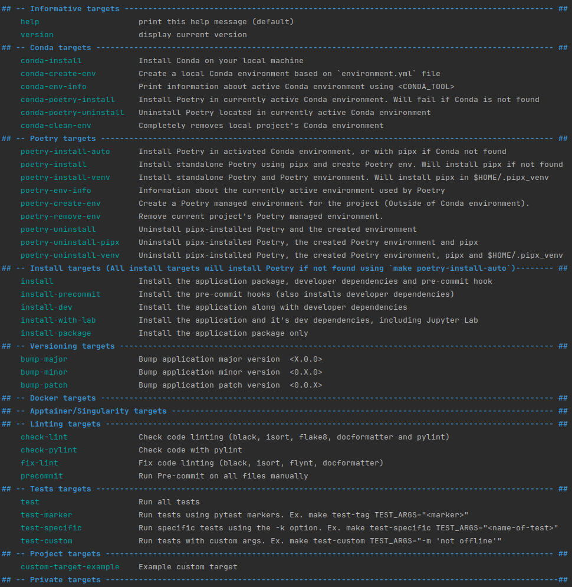

# Learning to run a power network 

## Description

Trying out some things for the [grid2op](https://grid2op.readthedocs.io/en/latest/index.html) RL power grid environment.

## Requirements

This project has only been tested in a Linux (Debian based) environment and assumes
some basic tools for development are already installed.

The project uses a Makefile to automate most operations. If `make` is available on your 
machine there's a good chance this will work.

## Initialization

### Git

Clone or fork the repository.

```shell
git clone https://github.com/viktor-ktorvi/learning-to-run-a-power-network.git
cd learning-to-run-a-power-network
```

### Make
If your machine doesn't already have make, run the following commands:

```shell
sudo apt-get update
sudo apt install build-essential
```

### Conda environment

If conda isn't already installed.
```shell
make conda-install 
```

If conda wasn't already installed close the shell and open it again.
Navigate back to the project repo, and create and activate the environment:

```shell
make conda-create-env
conda activate grid2op-env
make install
```

That should be it. You should now be able to run all the scripts and notebooks. If any problems arise, please raise an issue!

### Note when pulling and updated version of the codebase

When pulling and updated version of the codebase, make sure to run 

```shell
poetry install
```

to update the required environment packages.

## Basic Information

The different targets and their description can be examined by executing the command
`make targets`



## Python Version

This project uses Python version 3.11

## Build Tool

This project uses `poetry` as a build tool. Using a build tool has the advantage of 
streamlining script use as well as fix path issues related to imports.

## First Time User Quick Setup

### Installing poetry

Installing `pipx` and `poetry`:

```shell
make poetry-install
```

Next, let's choose how to manage our development environment

### Environment management choice

Choose between managing your development with either `poetry` or `conda`.

#### Poetry

Make sure that `python 3.11` is available either locally, through loaded cluster 
modules (ex. `module load python/<PYTHON_VERSION>`) or `pyenv` before executing the 
following command:

```shell
make poetry-create-env
```

Make sure to read up on [how to use your poetry virtual environment](https://python-poetry.org/docs/basic-usage/#using-your-virtual-environment)

You can:
* Use the `poetry run` command to access your executables
  * ex. `poetry run python your_script.py`, or `poetry run pylint src/`
* Use the `poetry shell` command to activate and step in your project environment

#### Conda

If working on a cluster, first load the appropriate module : 
`module load miniconda/3`

1. Create `conda` environment (will check for `conda` and install it if not found):

```shell
make conda-create-env
```

2. Activate `conda` environment (substitute with your <CONDA_TOOL> if something else 
than `conda`:

```
conda activate <environment_name>
```

### Install

Once the environment is taken care of, you can verify everything with the following 
command before continuing:

```shell
make poetry-env-info
```
or
```shell
poetry env info
```

and then install the package and it's dependencies:

```shell
make install
```

### Development

1. [Add required dependencies](./CONTRIBUTING.md#adding-dependencies)
2. Create some new modules in the [src](src/) folder!

## Detailed documentation

This project assumes environment management will be done with `conda`, classic 
python virtual environment, or directly through 
`poetry`. 

* [Poetry](https://python-poetry.org/docs/basic-usage/)
* [Conda](https://conda.io/projects/conda/en/latest/user-guide/getting-started.html)

While it is possible to manage the environment with, for example, pyenv or virtualenv, 
those specific use cases are not supported by the Makefile and require users to set up 
their own environments beforehand.

If you want to use something else than `conda` or `poetry` to manage environment isolation, 
it is recommended to follow 
[Poetry's guidelines on managing environments](https://python-poetry.org/docs/managing-environments/)

`poetry` is not included in the [environment.yml](environment.yml), due to some possible problems
in compute cluster environments, but will be installed automatically if needed
by most `install` targets.

See [Environment and Install targets](docs/makefile_environment_targets.md) for more 
information.

### Environment Management

Your project will need a virtual environment for your dependencies.

* [How to create a Conda environment](docs/conda_environment_creation.md)

If you do not wish to use `conda`, you will have to either 
manually install different versions of python manually for them to be usable by `poetry` 
or use a tool like [pyenv](https://github.com/pyenv/pyenv).

#### How to use conda with poetry

When using `conda`, it is important to understand that it is both an environment management 
tool AND a dependency management tool... and so is `poetry`. The difference is that with `conda` 
you can install different versions of python, as well as have access to non 
python applications.

To use them together, it is recommended to use `conda` as the environment and python 
version manager, while using `poetry` as the dependency manager.

Using `conda` to install non-python dependencies works great, but it is strongly recommended 
to avoid installing python dependencies with both `conda` and `poetry` in the same environment.

If you do need to install python dependencies in both (ex. pytorch through conda, and 
others using poetry), you need to be very careful as one dependency manager can and will
interfere with the dependencies managed by the other one and will make dependency 
conflicts very difficult to fix.

If there are no ways around it, you could also manage 2 environments at the same time, 
(one via conda and one via poetry), but it will require an enormous amount of discipline 
to work in that kind of context. This is strongly discouraged.  

####  Environment management choices

The choice of which environment manager to use between `conda` and `poetry` is ultimately 
determined by either project requirements or personal preference. Both are allowed and 
supported by this project.

## Useful targets for development

To run linting checks with `flake8`, `pylint`, `black` and `isort`:
```shell
make check-lint
```

To fix linting with `black`, `flynt` and `isort`:
```shell
make fix-lint
```

To run a `pre-commit` check before actually committing:
```shell
make precommit
```

To run tests:
```shell
make test
```

## Configurations
Configurations are in the [config/](configs) folder.

## Data

See [Data Readme](data/README.md)

## Experiment tracking

This section should contain information about how experiment tracking is handled
for this project, if applicable.

## Training

This section should contain information about how training, modeling and inference is handled
for this project, if applicable.

## Contributing to this repository

See [Contributing guidelines](CONTRIBUTING.md)
